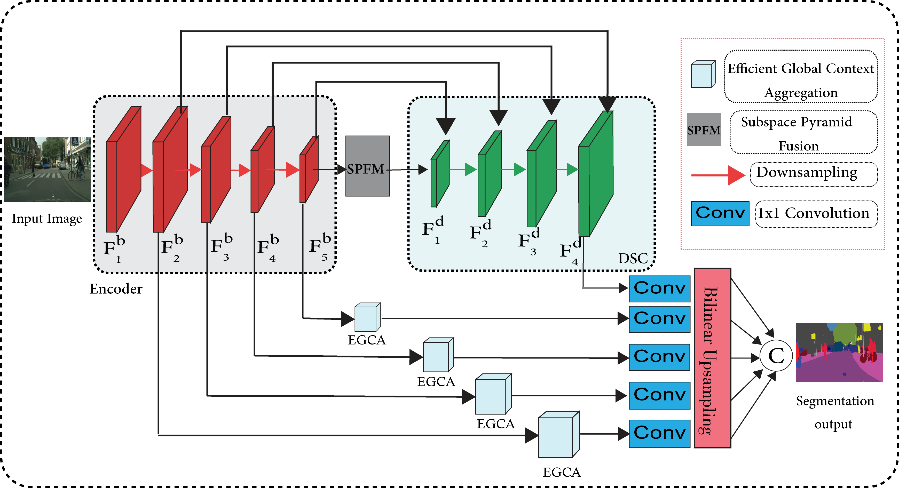
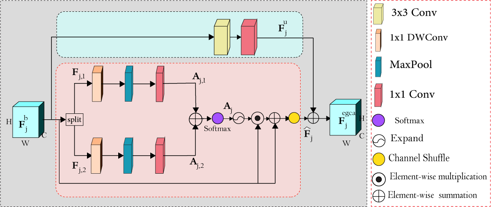

# SPFNet: Subspace Pyramid Fusion Network for Semantic Segmentation

### Introduction

The encoder-decoder structure has signifiantly improved performance in many vision tasks by fusing low-level
and high-level feature maps. However, this approach can hardly extract suffiient context information for pixel-wise segmentation. In addition, extracting similar low-level features at multiple
scales could lead to redundant information. To tackle these issues, we propose Subspace Pyramid Fusion Network (SPFNet).
Specifially, we combine pyramidal module and context aggregation module to exploit the impact of multi-scale/global context
information. At fist, we construct a Subspace Pyramid Fusion Module (SPFM) based on Reduced Pyramid Pooling (RPP). Then,
we propose the Effiient Global Context Aggregation (EGCA) module to capture discriminative features by fusing multi-level
global context features. Finally, we add decoder-based subpixel convolution to retrieve the high-resolution feature maps, which can help select category localization details. SPFM learns separate RPP for each feature subspace to capture multi-scale feature representations, which is more useful for semantic segmentation. EGCA adopts shuffl attention mechanism to enhance communication across different sub-features. Experimental results on two well-known semantic segmentation datasets, including Camvid and Cityscapes, show that our proposed method is competitive with other state-of-the-art methods.

                The detailed architecture of SPFNet

<p align="center"></p>

                Dialted Spatial Attention Module

<p align="center"></p>

### Installation

1. Pyroch Environment

- Env: Python 3.6; PyTorch 1.0; CUDA 10.1; cuDNN V8
- Install some packages

```
pip install opencv-python pillow numpy matplotlib
```

1. Clone this repository

```
git clone https://github.com/mohamedac29/SPFNet
cd DSANet
```

3. Dataset

You need to download the [Cityscapes](https://www.cityscapes-dataset.com/), and put the files in the `dataset` folder with following structure.

```
├── cityscapes_test_list.txt
├── cityscapes_train_list.txt
├── cityscapes_trainval_list.txt
├── cityscapes_val_list.txt
├── cityscapes_val.txt
├── gtCoarse
│   ├── train
│   ├── train_extra
│   └── val
├── gtFine
│   ├── test
│   ├── train
│   └── val
├── leftImg8bit
│   ├── test
│   ├── train
│   └── val
```

- Convert the dataset to [19 categories](https://github.com/mcordts/cityscapesScripts/blob/master/cityscapesscripts/helpers/labels.py).

- Download the [Camvid](https://github.com/alexgkendall/SegNet-Tutorial/tree/master/CamVid) dataset and put the files in the following structure.

```
├── camvid_test_list.txt
├── camvid_train_list.txt
├── camvid_trainval_list.txt
├── camvid_val_list.txt
├── test
├── testannot
├── train
├── trainannot
├── val
└── valannot

```

### Results

- Quantitative results:

|     Dataset      |  Pretrained  | Train type |    mIoU    |  FPS  |                                                                    model                                                                     |
| :--------------: | :----------: | :--------: | :--------: | :---: | :------------------------------------------------------------------------------------------------------------------------------------------: |
| Cityscapes(Fine) | from scratch |  trainval  |  |  | [Detailed result] |
|      CamVid      | from scratch |  trainval  |  |   |                                                                                                                                              |

- Qualitative segmentation examples on Cityscapes Dataset:

<p align="center"></p>

- Qualitative segmentation examples on Camvid Dataset:

<p align="center"></p>


## License

This code is released under the MIT License. See [LICENSE](LICENSE) for additional details.

